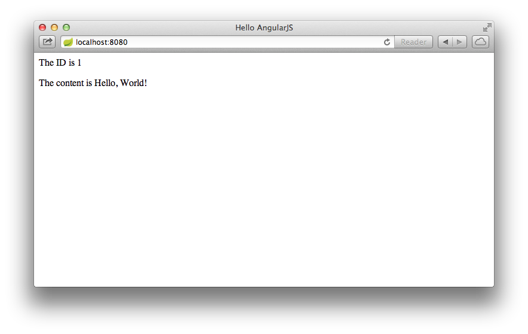

<#assign project_id="gs-consuming-rest-angularjs">
This guide walks you through writing a simple AngularJS client that consumes a Spring MVC-based [RESTful web service][u-rest].

What you'll build
-----------------

You will build an AngularJS client that consumes a Spring-based RESTful web service.
Specifically, the client will consume the service created in [Building a RESTful Web Servce][gs-rest-service].

The AngularJS client will be accessed by opening the `index.html` file in your browser, and will consume the service accepting requests at:

    http://rest-service.guides.spring.io/greeting

The service will respond with a [JSON][u-json] representation of a greeting:

```json
{"id":1,"content":"Hello, World!"}
```

The AngularJS client will render the ID and content into the DOM.

What you'll need
----------------

 - About 15 minutes
 - A favorite text editor
 - A modern web browser
 - An internet connection

Create an AngularJS Controller
------------------------------

First, you will create the AngularJS controller module that will consume the REST service: 

    <@snippet path="hello.js" prefix="complete"/>

This controller module is represented as a simple JavaScript function that is given AngularJS's `$scope` and `$http` components.
It uses the `$http` component to consume the REST service at "/greeting".

If successful, it will assign the JSON returned back from the service to `$scope.greeting`, effectively setting a model object named "greeting".
By setting that model object, AngularJS can bind it to the application page's DOM, rendering it for the user to see.

Create the Application Page
---------------------------

Next, you'll create the HTML page that will load the client into your web browser:

    <@snippet path="index.html" prefix="complete"/>

For the most part, this is a basic HTML file.
But there are a few noteworthy things to draw your attention to.

First, notice that the page loads two script files.
It loads the minified AngularJS library (angular.min.js) from a content delivery network (CDN) so that you don't have to download AngularJS and place it in your project.
It also loads the controller code (hello.js) from the application's path.

The AngularJS library enables several custom attributes for use with standard HTML tags.
In index.html, two such attributes are in play:

 * The `<html>` tag has the `ng-app` attribute to indicate that this page is an AngularJS application.
 * The `<div>` tag has the `ng-controller` attribute set to reference `Hello`, the controller module.

Finally, with the two `<p>` tags, there are a couple of placeholders identified with double-curly-braces.
These are placeholders reference the `id` and `content` properties of the `greeting` model object which was set upon successfully consuming the REST service.

Run the client
---------------

You can now open the `index.html` page in your browser, where you see: 



The ID value will increment each time you refresh the page.

Summary
-------

Congratulations! You've just developed an AngularJS client that consumes a Spring-based RESTful web service.

<@u_rest/>
<@u_json/>
<@u_git/>
